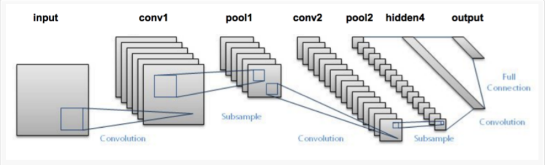

# Classification d'images medical avec Keras et deep learning
utilisation de CNN réseau de neurones conventionnels profonds pour la détection et la prédiction des tumeurs malignes et bénignes à partir des images médicales  

## Introduction 
Au cours de la dernière décennie, la capacité des programmes informatiques d'extraire l'information des images s'est considérablement accrue. cette progression est du  aux réseaux neuronaux convolutionnels (CNNs), un type de réseau neuronal spécialisé dans le traitement des image. Depuis 2012, année où AlexNet a remporté le concours de reconnaissance visuelle à grande échelle ImageNet, les CNN ont constamment surpassé les techniques classiques d'apprentissage machine (p. ex. machines à vecteurs support, forêt aléatoire, k-voisins les plus proches). L'essentiel du travail de conception d'un algorithme ML classique consiste à choisir les caractéristiques appropriées. En revanche, un réseau neuronal profond prend des données brutes (éventuellement après quelques prétraitements) et apprend automatiquement les caractéristiques. 
dans la suite de cet article nous allons vous proposer une architecture de CNN efficace pour la classification des images médicales 

le reste de l'article est diviser en trois parties 
* Envirenement de travail 
* Entrainement et apprentissage de CNN 
* Test et validation 
* Echantillonage 


## Envirenement de travail
pour l'envirenement de travail j'ai utulisé ANACONDA et GOOGLE COLAB.
ANACONDA est  un envirenement intégré de l'apprentissage machine disponible sur Linux, Windows et Mac OS X.
GOOGLE COLAB  est un environnement de notebook Jupyter gratuit qui ne nécessite aucune configuration et qui s'exécute entièrement dans le cloud [Pour en savoir plus](http://www.ac-grenoble.fr/ugine/m/?p=271).
pour installer ANACONDA voir ce [tutoriel](http://www.ac-grenoble.fr/ugine/m/?p=271)

pour lancer ANACONDA sur linux: 
```
source activate base
```
maintenant faut installer tous les dépendences, librairies et framework qu'on va utiliser 
installer keras sous anaconda envirenement 

```
pip install keras
```
keras utilise TenserFlow en background qui est déja installer sous anaconda 

installation de openCV 
```
conda install -c conda-forge opencv
```

installation de la librairies imutils

```
pip install imutils
```

## Entrainement et apprentissage de CNN 
### Datasets et pre-traitement 
pour l'apprentissage d'un réseaux de neurones il faut une base de données massive des images, les images médicales utilisés dans ce travail peuvent avoir des dimensions dépassent  80k*80k pour utiliser des telles images comme entrée d'un réseaux de neurones faut avoir des super machine avec des processeurs graphique comme Nvidia Titan X 
d'ou la nécissité d'utiliser de découper ces images en imagettes de taille 28*28,32*32,64*64

le CNN qu'on va construire prend en entrée un patch de taille 28*28 
pour découper les grandes images en patchs: 
```
python split_oneTomany.py DOSSIER_SOURCE DOSSIER_DESTINATION
```
### CNN
L'architecture De CNN se compose de deux ensembles de couches convolutionnelles, d'activation et de mise en groupe(pooling), suivis d'une couche entièrement connectée, d'une autre entièrement connectée et enfin d'un classificateur softmax.

<figure>
    
</figure>
		figure 1: architecture CNN lenet
nous allons implémenter cette architecture avec keras et TenserFlow

cette architecture est Conçu à l'origine pour la classification des chiffres manuscrits, nous pouvons facilement l'étendre à d'autres types d'images également.
l'archietecture de CNN qu'on va utiliser est dans lenet.py 
*code exlication 

Les premieres lignes  gèrent l'importation de nos paquets Python requis:
La classe Conv2D réalise l'operation de convolution. 
```
class LeNet:
	@staticmethod
	def build(width, height, depth, classes):
```
la classe Lenet contient la méthode static de construction, a chaque fois j'appelle la classe il sera appelé automatiquement.
la méthode build a 4 paramétres
* width : La largeur de nos images d'entrée
* height : La hauteur des images d'entrée
* depth : Le nombre de canaux dans nos images d'entrée 
* classes : Le nombre total de classes que nous voulons reconnaître (dans notre cas, deux: malign, benign)
```
# les 3 trois premiers couches CONV => RELU => POOL
model.add(Conv2D(20, (5, 5), padding="same",
	input_shape=inputShape))
model.add(Activation("relu"))
model.add(MaxPooling2D(pool_size=(2, 2), strides=(2, 2)))

# les 3 trois douxieme couches CONV => RELU => POOL
model.add(Conv2D(50, (5, 5), padding="same"))
model.add(Activation("relu"))
model.add(MaxPooling2D(pool_size=(2, 2), strides=(2, 2)))

# utilisation de fontion d'activation softmax 
model.add(Flatten())
model.add(Dense(500))
model.add(Activation("relu"))
model.add(Dense(classes))
model.add(Activation("softmax"))
return model
```

## Entrainement et apprentissage de CNN

pour l'entrainement on va faire appel au model.py 
au top de fichier on importe les paquets requis qui nous permettent:
* Charger les imagesà partir de mémoire
* Pré-traitement des images
* Instantier le réseau neuronal convolutif
* entrainer le model


